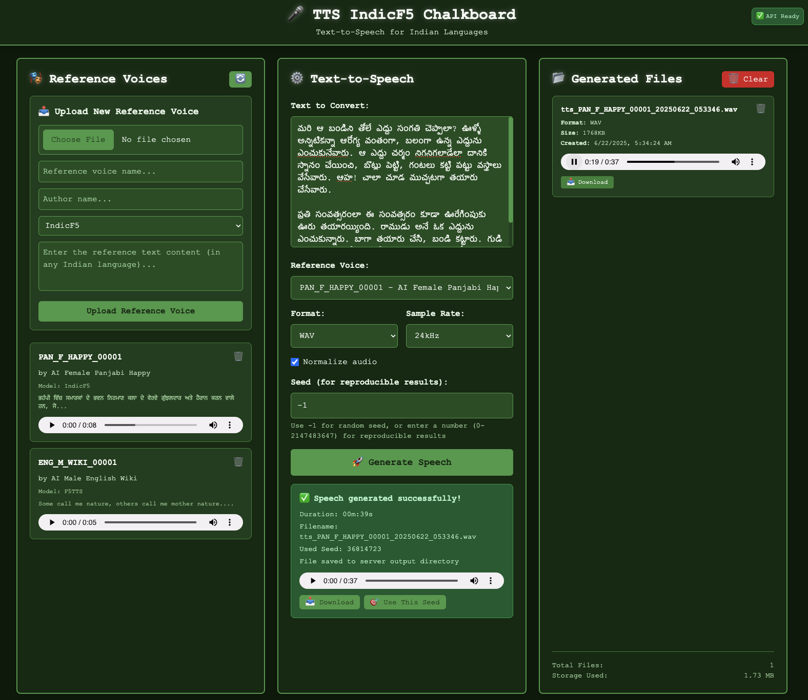
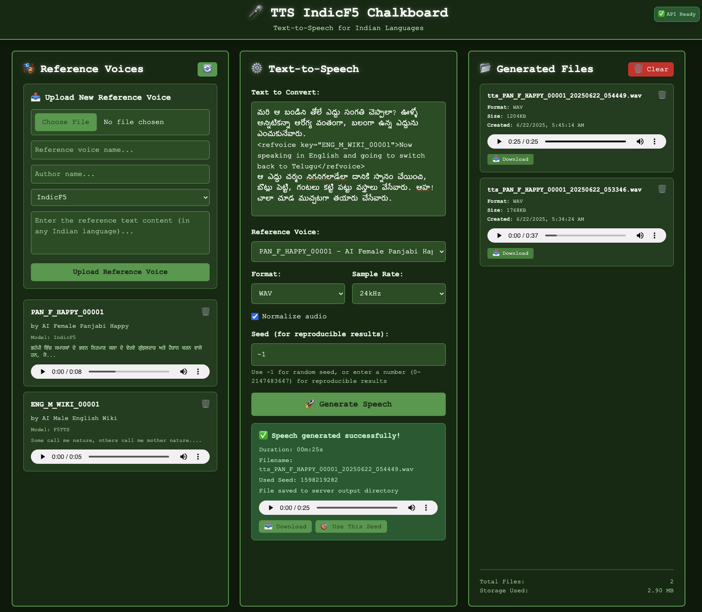

## 🚀 Harnessing AI for Text-to-Speech: English and Indian Languages locally with basic GPU/CPU

### Why Local TTS Matters

- Text-to-Speech technologies are now delivering near-human quality
- Open-source models lets us run them locally, no cloud, no monthly bills, full control and private.
- Tool like
  - [IndicF5](https://github.com/AI4Bharat/IndicF5) for Indian languages (Telugu, Tamil, Hindi etc.)
  - [F5 TTS](https://github.com/SWivid/F5-TTS) for English (Base for IndicF5).
  - [Chatterbox](https://github.com/resemble-ai/chatterbox) (sometimes dubbed _ChatterTTS_) for English
- By optimizing for GPU acceleration, it's now practical to run or host them on local computers.

---

### IndicF5: TTS trained in Indian Languages

**IndicF5** by [AI4Bharat](https://ai4bharat.iitm.ac.in/) (IIT Madras) is a TTS model supporting 11 Indian languages including Tamil and Telugu—trained on 1,417 hrs of speech data.

#### Key Features

- Supports **Assamese, Bengali, Gujarati, Hindi, Kannada, Malayalam, Marathi, Odia, Punjabi, Tamil, Telugu**
- Near‑human quality across languages, built on `F5‑TTS`
- **Voice cloning** via reference prompts
- 24 kHz audio output

#### Install & Generate Speech

- Initially I struggled to get this work on my local machine, even though its stright forward in the documentation. It might be due to lack of my knowledge on working with Huggingface or TTS models.
- But after hours of researching, I could, not just run on my system but was able to enhance it to work with `MPS (Apple Silicon) GPU` (which is amazingly fast on my Mac Studio)
- I thought it would be helpful if I can make this easy to run with single command both locally and in Docker (if needed), so I created a fork of `IndicF5` and added these functionalities.
- This is no way an enhancement to the IndicF5, all credit should go to `AI4Bharat` team, I just want to make it easy to run it locally by automating the installation and use locally on my huge collection of Indic texts, which is not feasable to upload on to some cloud.

##### Build and run locally

```bash
# Clone repo
git clone https://github.com/hareeshbabu82ns/TTSIndicF5.git


# run locally (ex. on mac with MPS support)
./start_api.sh
```

- this will check for `conda` or `venv` environment (tries to create one)
- install dependencies and start the app at `https://localhost:8000/api_demo.html`
- All the code for web is generated using `Github Copilot` (just modified a little to my requirements)
- app gives 2 reference voice with models selected `PAN_F_HAPPY_00001 - IndicF5` (for Indic languages) and `ENG_M_WIKI_00001 - F5TTS` (for English)
- Just enter the `Text to Convert` and click on `Generate Speech` and see the the magic happen
  
- For this 62 words Telugu phrase the generation on my Mac Studio (M4 Max 64 GB) took 39 seconds
- To make this more usable, I have added the Language switching and stiching the audio to produce single output (as per my use case), now the following text starts with Telugu, switches to English and back to Telugu.

```
మరి ఆ బండిని తోలే ఎద్దు సంగతి చెప్పాలా? ఊళ్ళో అన్నిటికన్నా ఆరోగ్య వంతంగా, బలంగా ఉన్న ఎద్దును ఎంచుకునేవారు.
<refvoice key="ENG_M_WIKI_00001">Now speaking in English and going to switch back to Telugu</refvoice>
ఆ ఎద్దు చర్మం నిగనిగలాడేలా దానికి స్నానం చేయించి, బొట్లు పెట్టి, గంటలు కట్టి పట్టు వస్త్రాలు వేసేవారు. ఆహ! చాలా చూడ ముచ్చటగా తయారు చేసేవారు.
```



##### Run using Docker

```bash
# builds locally and run
docker compose -f docker-compose.yml --env-file .env up

# pulls pre-built Github Repository container to run
docker compose -f docker-compose-prod.yml --env-file .env.prod up -d
```

- sample `.env.prod` file

```env
VERSION=0.0.4
PORT=8000
```

---

### Integration: Unified API & UI

I layered both under a unified FastAPI:

- `/tts` endpoint provid the functionalities like
  - simple text to speach, for selected reference audio
  - if the text is bigger, then it will auto chunk to 300 chars or to the scentence
  - parses for the tag `<refvoice key="">text</refvoice>` in the text and automatically switches
- `/referenceVoices` endpoint provides CRUD functionality to upload and manage Reference Voice and Text to provide as input to `Model Inference`
- `/files` endpoint helps to view and play `Generated Audio`
- `/docs` provides Swagger documentation of the API

Frontend lets users input text, choose reference audio, adjust seed, and listen to generated output.

---

### Use Cases & Tutorials

- **Podcast generation** in English or Indian Language voices
- **Educational narration** (AI reading local tales, news)
- **Accessibility**, e.g., screen readers in regional languages
- **Game narration**, dynamic voice effects across languages

---

### Conclusion & Next Steps

Big Thanks for AI4Bharat in putting the efforts and training these models and making it available and Thanks to Hugginface for hosting such a huge list of AI models, searchable and use.

Open-source AI TTS now lets us run top-tier voice models on our own hardware. With IndicF5, I was able to quickly assemble a flexible, GPU-powered pipeline covering both English and Indian languages—zero cloud dependency, full customization, and expressive voice control.

I think for ways of `How I can use AI to boost my Productivity and Intelligence.` rather to just help AI to grow its Intelligence and make me Dumb. Although, AI is a great tool, but becomes a fatal mistake when learning if we relay more on AI to do research, which I feal is the best part of learning as we stumble upon new things and opens up more doors.

Next steps:

- Expand Indian language support across others
- Add batching & streaming
- Incorporate fine‑tuning on custom voices and emotions
- Build cross-lingual voice conversion features
